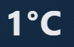
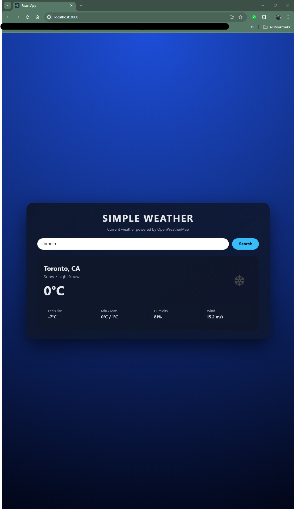
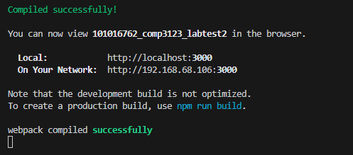

101016762_comp3123_labtest2 – Simple Weather App

I decided to use openweathermap api and create A weather search application 

This application allows users to search for any city and view the current weather based on data from the OpenWeatherMap API.
The UI displays:

### Temperature (°C)

### Weather condition & description

### Country + city name

### Feels-like temperature

### Min/Max temperature

### Humidity
*(Add screenshot here if needed)*

### Wind speed

### Weather icon (from OpenWeatherMap)

### Dynamic search functionality

How to Running the Project Locally
1. Clone the repository:
git clone https://github.com/aaronsabilano/101016762_comp3123_labtest2

2. Install dependencies:
npm install

3. Create a .env file in the project root with YOUR api key:
REACT_APP_WEATHER_API_KEY=YOUR_API_KEY_HERE

4. Start the development server:
npm start

The app will open at:

http://localhost:3000

🌐 API Used

OpenWeather – Current Weather Data
Endpoint:

https://api.openweathermap.org/data/2.5/weather?q={CITY}&appid={API_KEY}&units=metric

📸 Screenshots

